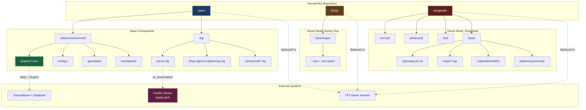
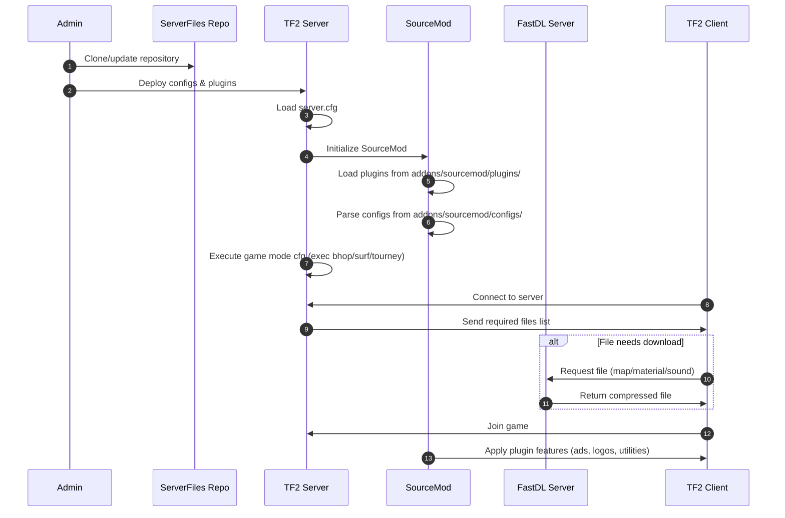

# ServerFiles

A centralized configuration repository for UDL.TF Team Fortress 2 game servers, managing SourceMod plugins, server configurations, and game mode assets.

[](LICENSE)

## Overview

ServerFiles serves as the single source of truth for all UDL.TF Team Fortress 2 server configurations and assets. This repository manages everything from SourceMod plugins and their configurations to game mode-specific settings and custom map files. By centralizing these resources, it ensures consistency across all server instances while providing a versioned history of all server changes.

The repository follows a modular structure where shared base configurations are stored in the `base/` directory, while game mode-specific configurations (Bunny Hop, Dodgeball) are organized in their own directories. This approach allows for efficient deployment of different server types while maintaining common plugins and configurations. The system is designed to work with FastDL for quick client downloads and supports multiple server difficulty levels (normal, advanced, test) for the dodgeball game mode.

Built on top of SourceMod, a popular Source engine server modification framework, ServerFiles includes essential plugins for server management, anti-cheat systems (SourceBans++), player utilities, and game mode-specific enhancements. The configuration system leverages SourceMod's modular approach and Valve's config execution system to provide flexible server behavior across different game modes.

### Key Responsibilities

- **Plugin Management**: Hosts compiled SourceMod plugins (.smx files) for server functionality including admin tools, SourceBans++ integration, player utilities, and game mode features
- **Configuration Distribution**: Maintains centralized server configs (server.cfg, game mode-specific configs) that define server behavior, networking, logging, and SourceMod plugin settings
- **Asset Management**: Organizes custom maps and materials, utilizing chunked compression (.bz2.parts) for large map files to overcome GitHub file size limitations
- **Game Mode Support**: Provides isolated configuration sets for different TF2 game modes (Bunny Hop, Dodgeball) with varying difficulty levels and specific plugin requirements

## Architecture



## How It Works

### Server Initialization Flow



### Map File Management State Machine


## Features

- **SourceMod Plugin Suite**: Comprehensive collection of server management plugins including admin controls (admingrab.smx), communication systems (advertisements.smx, tidychat.smx), and player utilities (respawn.smx, hugkiss.smx, aimnames.smx)
- **SourceBans++ Integration**: Full SourceBans++ system with main functionality (sbpp_main.smx), communications management (sbpp_comms.smx), admin configuration (sbpp_admcfg.smx), checker (sbpp_checker.smx), reporting (sbpp_report.smx), and sleuth capabilities (sbpp_sleuth.smx) for centralized ban management
- **Game Mode Configurations**: Dedicated configuration files for multiple TF2 game modes including bunny hop (bhop.cfg), surf (surf.cfg), and tournament (tourney.cfg) modes with optimized settings for each playstyle
- **FastDL Integration**: Configured sv_downloadurl pointing to http://fastdl.udl.tf/ for rapid client-side asset downloads, reducing connection times and improving player experience
- **Custom Map Support**: Organized storage for custom maps with intelligent handling of large files through .bz2 compression and part-splitting to overcome GitHub's file size limitations
- **Modular Difficulty System**: Dodgeball game mode supports three difficulty levels (normal, advanced, test) with separate plugin configurations and settings allowing progressive gameplay challenges
- **Network Optimization**: Dedicated network.cfg with optimized server networking settings, rate limits, and bandwidth configurations for stable multiplayer performance
- **Comprehensive Logging**: Structured logging configuration (log.cfg) for server events, player actions, and plugin activities, essential for debugging and server administration
- **Translation Support**: Multi-language translation files for plugins (hugkiss.phrases.txt, respawn.phrases.txt, sbpp_*.phrases.txt) enabling internationalization of server messages
- **Extension Ecosystem**: Collection of SourceMod extensions and gamedata files (connect.games.txt, tf2.attributes.txt, sourcetvmanager.games.txt) providing low-level functionality for advanced plugin features

## Prerequisites

- Team Fortress 2 Dedicated Server (srcds)
- SourceMod (latest stable version recommended)
- MetaMod:Source (dependency for SourceMod)
- FastDL server or CDN for hosting downloadable content
- SourceBans++ database (for ban management plugins)

## Installation

### Server Deployment

1. **Clone the repository**:
   ```bash
   git clone https://github.com/UDL-TF/ServerFiles.git
   cd ServerFiles
   ```

2. **Deploy base files to your TF2 server**:
   ```bash
   # Copy base configurations (required for all servers)
   cp -r base/addons/* /path/to/tf2server/tf/addons/
   cp -r base/cfg/* /path/to/tf2server/tf/cfg/
   ```

3. **Deploy game mode-specific files**:
   
   For Bunny Hop servers:
   ```bash
   cp -r bhop/base/maps/* /path/to/tf2server/tf/maps/
   ```
   
   For Dodgeball servers (choose difficulty):
   ```bash
   # Base files (required)
   cp -r dodgeball/base/addons/* /path/to/tf2server/tf/addons/
   cp -r dodgeball/base/cfg/* /path/to/tf2server/tf/cfg/
   cp -r dodgeball/base/maps/* /path/to/tf2server/tf/maps/
   cp -r dodgeball/base/materials/* /path/to/tf2server/tf/materials/
   
   # Then choose difficulty level
   cp -r dodgeball/normal/addons/* /path/to/tf2server/tf/addons/  # For normal
   # OR
   cp -r dodgeball/advanced/addons/* /path/to/tf2server/tf/addons/  # For advanced
   # OR
   cp -r dodgeball/test/addons/* /path/to/tf2server/tf/addons/  # For test
   ```

4. **Handle large map files** (if .bz2.parts exist):
   ```bash
   # Reassemble split map files
   cd /path/to/tf2server/tf/maps
   for dir in *.bsp.bz2.parts; do
       mapname="${dir%.bsp.bz2.parts}"
       cat "$dir"/*.part.* > "${mapname}.bsp.bz2"
       bunzip2 "${mapname}.bsp.bz2"
   done
   ```

5. **Configure server launch parameters**:
   ```bash
   ./srcds_run -game tf +map <initial_map> +maxplayers 24 +exec server.cfg
   ```

6. **Upload maps to FastDL server**:
   - Compress maps: `bzip2 -k mapfile.bsp`
   - Upload .bsp.bz2 files to your FastDL server matching the path structure
   - Ensure FastDL URL in server.cfg matches your CDN

## Configuration

### Key Configuration Files

| File                 | Description                                                               | Location                                           |
| -------------------- | ------------------------------------------------------------------------- | -------------------------------------------------- |
| `server.cfg`         | Main server configuration with sv_downloadurl, sv_tags, and core settings | `base/cfg/server.cfg`                              |
| `bhop.cfg`           | Bunny hop mode-specific settings                                          | `base/cfg/bhop.cfg`                                |
| `surf.cfg`           | Surf mode-specific settings                                               | `base/cfg/surf.cfg`                                |
| `tourney.cfg`        | Tournament mode settings                                                  | `base/cfg/tourney.cfg`                             |
| `network.cfg`        | Network and bandwidth configuration                                       | `base/cfg/network.cfg`                             |
| `log.cfg`            | Logging configuration                                                     | `base/cfg/log.cfg`                                 |
| `plugins.cfg`        | Plugin-specific settings                                                  | `base/cfg/plugins.cfg`                             |
| `sourcetv.cfg`       | SourceTV demo recording settings                                          | `base/cfg/sourcetv.cfg`                            |
| `advertisements.txt` | Server advertisement messages                                             | `base/addons/sourcemod/configs/advertisements.txt` |
| `serverhudlogo.cfg`  | Server HUD logo configuration                                             | `base/addons/sourcemod/configs/serverhudlogo.cfg`  |
| `tidychat.cfg`       | Chat formatting and filtering                                             | `base/cfg/sourcemod/tidychat.cfg`                  |
| `spirt.dl.cfg`       | Spirit download precache configuration                                    | `base/cfg/sourcemod/spirt.dl.cfg`                  |

## Development

### Project Structure

```
ServerFiles/
├── .github/                     # GitHub Actions and workflows
├── base/                        # Shared base files for all servers
│   ├── addons/
│   │   ├── srctvplus.vdf        # SourceTV Plus plugin metadata
│   │   ├── TickrateEnabler.vdf  # Tickrate modification plugin metadata
│   │   └── sourcemod/
│   │       ├── configs/         # SourceMod plugin configuration files
│   │       │   ├── advertisements.txt
│   │       │   ├── serverhudlogo.cfg
│   │       │   ├── ripext/      # REST in Pawn extension configs
│   │       │   ├── sourcebans/  # SourceBans++ configuration
│   │       │   │   └── overrides_backup.cfg
│   │       │   └── SpirT/       # Spirit precache configs
│   │       ├── extensions/      # SourceMod extensions (.so/.dll files)
│   │       ├── gamedata/        # Game signatures and offsets
│   │       │   ├── connect.games.txt
│   │       │   ├── conplex.games.txt
│   │       │   ├── filenetwork.txt
│   │       │   ├── sm-tf2.games.txt
│   │       │   ├── sourcetvmanager.games.txt
│   │       │   └── tf2.attributes.txt
│   │       ├── plugins/         # Compiled SourceMod plugins (.smx)
│   │       │   ├── admingrab.smx
│   │       │   ├── advertisements.smx
│   │       │   ├── aimnames.smx
│   │       │   ├── discord.smx
│   │       │   ├── sbpp_*.smx   # SourceBans++ plugin suite
│   │       │   ├── serverlogo.smx
│   │       │   └── ...
│   │       └── translations/    # Multi-language phrase files
│   │           ├── hugkiss.phrases.txt
│   │           ├── respawn.phrases.txt
│   │           └── sbpp_*.phrases.txt
│   └── cfg/                     # Server configuration files
│       ├── server.cfg           # Main server config
│       ├── bhop.cfg             # Bunny hop mode config
│       ├── surf.cfg             # Surf mode config
│       ├── tourney.cfg          # Tournament mode config
│       ├── network.cfg          # Network settings
│       ├── log.cfg              # Logging configuration
│       ├── plugins.cfg          # Plugin-specific settings
│       ├── sourcetv.cfg         # SourceTV settings
│       └── sourcemod/           # SourceMod-specific configs
│           ├── spirt.dl.cfg
│           └── tidychat.cfg
├── bhop/                        # Bunny hop game mode files
│   └── base/
│       └── maps/                # Bunny hop maps
│           ├── bhop_arcane2_a06.bsp
│           └── bhop_arcane2_a06.bsp.bz2.parts/  # Split compressed parts
│               ├── bhop_arcane2_a06.bsp.bz2.part.000
│               ├── bhop_arcane2_a06.bsp.bz2.part.001
│               └── ...
├── dodgeball/                   # Dodgeball game mode files
│   ├── base/                    # Shared dodgeball files
│   │   ├── addons/sourcemod/
│   │   │   ├── configs/         # Dodgeball plugin configs
│   │   │   ├── plugins/         # Dodgeball-specific plugins
│   │   │   └── translations/    # Dodgeball translations
│   │   ├── cfg/
│   │   │   ├── mapcycle.txt     # Map rotation
│   │   │   └── sourcemod/
│   │   │       ├── dodgeball_enable.cfg
│   │   │       ├── dodgeball_disable.cfg
│   │   │       ├── dodgeball_ffa_enable.cfg
│   │   │       ├── dodgeball_ffa_disable.cfg
│   │   │       └── Nanobot.cfg
│   │   ├── maps/                # Custom dodgeball maps
│   │   │   ├── tfdb_box_space_udl_a7.bsp
│   │   │   ├── tfdb_octagon_udl_v4.bsp
│   │   │   ├── tfdb_rocketbucks_udl_v6.bsp
│   │   │   └── tfdb_spacebox_udl_a4.bsp
│   │   └── materials/           # Custom materials/textures
│   │       └── models/custom/
│   ├── normal/                  # Normal difficulty config overrides
│   │   └── addons/sourcemod/configs/
│   ├── advanced/                # Advanced difficulty config overrides
│   │   └── addons/sourcemod/configs/
│   └── test/                    # Test/experimental config overrides
│       └── addons/sourcemod/configs/
├── LICENSE                      # MIT License
└── README.md                    # This file
```

### How Maps Work

#### Map File Organization

Maps in this repository are organized by game mode under their respective directories (`bhop/base/maps/`, `dodgeball/base/maps/`). Each map consists of:

1. **The .bsp file**: The actual compiled Source engine map file that the server loads
2. **The .bsp.bz2 file**: Compressed version uploaded to FastDL for client downloads
3. **The .bz2.parts/ directory**: Split compressed parts stored in GitHub for large maps

#### GitHub Large File Handling

GitHub has a 100MB file size limit. Many custom TF2 maps exceed this limit, so this repository uses a chunking system:

```
bhop_arcane2_a06.bsp                        # Actual map file (too large for GitHub)
bhop_arcane2_a06.bsp.bz2.parts/             # Directory containing split parts
├── bhop_arcane2_a06.bsp.bz2.part.000       # Part 1 (< 100MB)
├── bhop_arcane2_a06.bsp.bz2.part.001       # Part 2 (< 100MB)
├── bhop_arcane2_a06.bsp.bz2.part.002       # Part 3 (< 100MB)
└── ...                                      # Additional parts as needed
```

**Creating split map files**:
```bash
# Compress the map
bzip2 -k mapfile.bsp  # Creates mapfile.bsp.bz2

# Split into 95MB chunks (safely under 100MB limit)
mkdir mapfile.bsp.bz2.parts
split -b 95M mapfile.bsp.bz2 mapfile.bsp.bz2.parts/mapfile.bsp.bz2.part.
```

**Reassembling split map files**:
```bash
# Concatenate parts back together
cat mapfile.bsp.bz2.parts/*.part.* > mapfile.bsp.bz2

# Decompress
bunzip2 mapfile.bsp.bz2  # Creates mapfile.bsp
```

#### Map Deployment Best Practices

1. **Always compress maps for FastDL**: Use `bzip2 -k mapfile.bsp` to create .bsp.bz2 files
2. **Test maps locally first**: Verify maps load correctly before committing
3. **Use consistent naming**: UDL maps follow pattern `gamemode_mapname_udl_version.bsp`
4. **Update mapcycle.txt**: Add new maps to `dodgeball/base/cfg/mapcycle.txt` for rotation
5. **Version your maps**: Include version numbers in filenames (e.g., _v4, _a06 for alpha)
6. **Keep source files external**: .vmf (map source) files should not be committed to this repo

## License

See [LICENSE](LICENSE) file for details.

## Dependencies

- [SourceMod](https://www.sourcemod.net/) - Source engine server modification framework
- [MetaMod:Source](https://www.metamodsource.net/) - Plugin loading framework for Source engine servers
- [SourceBans++](https://sbpp.github.io/) - Advanced ban management system for Source servers
- [RipExt](https://github.com/ErikMinekus/sm-ripext) - REST in Pawn extension for HTTP/HTTPS requests
- [TF2 Attributes](https://github.com/FlaminSarge/tf2attributes) - Plugin for modifying TF2 item attributes
- [SteamWorks](https://github.com/KyleSanderson/SteamWorks) - Extension providing access to Steam API
- [SourceTV Manager](https://github.com/peace-maker/sourcetvmanager) - Enhanced SourceTV control and management
